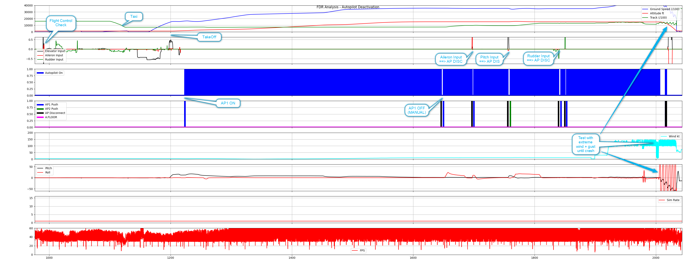

# FDR Analysis Tools

The FlyByWire autoflight system has a built-in data collection to help with development, debugging and user support.

The idea is taken from real aircraft and their flight data recorder and helps to analyze issues and performance of the simulated aircraft. 

To see which data is collected see `data_fields.txt` in the `docs` folder. 

To learn how to configure the data collection see this folder on the main a32nx repository:
https://github.com/flybywiresim/a32nx/tree/master/fbw-a32nx/docs/Configuration

## Folders

- `/docs`: Documentation
- `/fdr2csv`: Converter tool from *.fdr files to *.csv. Source can be found [in the main A32NX repo](https://github.com/flybywiresim/aircraft/tree/master/tools/fdr2csv)
- `/python`: Base scripts for development and debugging
- `/support`: Scripts targeted mainly for support staff and user support. 

## Usage

## FDR Files in WORK Folder

FDR data files are stored in the aircraft's work folder. 

### Microsoft Store Version

The work folder can be found here:

`%LOCALAPPDATA%\Packages\Microsoft.FlightSimulator_8wekyb3d8bbwe\LocalState\packages\flybywire-aircraft-a320-neo\work\`

### Steam Version

The work folder can be found here:

`%APPDATA%\Microsoft Flight Simulator\Packages\flybywire-aircraft-a320-neo\work\`

FDR files are basically log files of a lot of parameters of the sim and the aircraft (ap/a-thr/fbw) in a special compressed format.

Every time the users starts a new flight a new file is created. For very long flight files are split into several files. 

Example file name: 2021-11-15-12-57-13.fdr

### Create an Analysis Chart From the Data

Test FDR file: 2021-11-15-12-57-13.fdr

1. Convert the fdr file to csv

	fdr2csv_v11.exe -i .\2021-11-15-12-57-13.fdr -o .\2021-11-15-12-57-13.csv 
	
	(you might need to use a different version of the fdr2csv_vx.exe for different versions of the a32nx)

2. Create a graph:

	fdr_scriptname.py -f .\2021-11-15-12-57-13.csv	

## Example 

See example.png for an explanation of a Autopilot Disconnect Analysis Chart.

