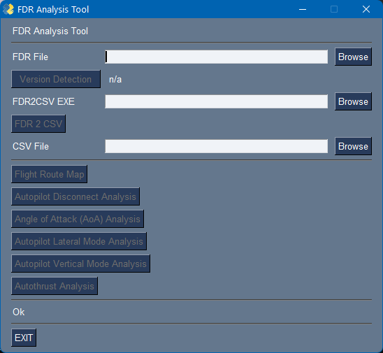

# FDR Analysis 

## Installation

- Download the support-fdr-package.zip
- Extract it in a folder of your choice
  - make sure it has the `fdr_analyser_ui.exe` and the `fdr2csv` folder
- Run `fdr_analyser_ui.exe`  

## Usage

```
> fdr_analyser_ui.exe --help
usage: fdr_analyser_ui.exe [-h] [-fdr FDRFILE] [-csv CSVFILE] [-exe EXEFILE] [-c COMMAND] [-cl]

FDR file analysis

optional arguments:
  -h, --help            show this help message and exit
  -fdr FDRFILE, --fdrfile FDRFILE
                        FDR file to analyze
  -csv CSVFILE, --csvfile CSVFILE
                        CSV file to analyze
  -exe EXEFILE, --exefile EXEFILE
                        EXE file for fdr2csv conversion (only for ui)
  -c COMMAND, --command COMMAND
                        FDR Chart Command (map, ap, aoa, apl, apv, athr)
  -cl, --commandline    Command line usage - no ui
```  

## How to Analyse FDR data

- Run `fdr_analyser_ui.exe` 

    

- Choose the FDR file you want to analyze
- Click on `Version Detection`
  - if this button is not enabled the FDR File is not a valid file names
  - this detects the required fdr2csv exe version and puts its path in to the FDR2CSV field
- Click on `FDR 2 CSV`
  - this starts the conversion process and will create a csv file with the same name as the fdr file in the same directory as the
  - this process might take a few minutes (ui freezes during this time)
  - if the CSV file is created it is shown in the CSV File chooser the Analyse buttons become available
- Click on the desired analyse button
- Done

If you already have a CSV file you can directly choose this into the CSV File chooser and analyse it.

## FDR Files in WORK Folder

FDR data files are stored in the aircraft's work folder. 

FDR files are basically log files of a lot of parameters of the sim and the aircraft (ap/a-thr/fbw) in a special compressed format.

Every time the users starts a new flight a new file is created. For very long flight files are split into several files. 

Example file name: 2021-11-15-12-57-13.fdr

### Microsoft Store Version

The work folder can be found here:

`%LOCALAPPDATA%\Packages\Microsoft.FlightSimulator_8wekyb3d8bbwe\LocalState\packages\flybywire-aircraft-a320-neo\work\`

### Steam Version

The work folder can be found here:

`%APPDATA%\Microsoft Flight Simulator\Packages\flybywire-aircraft-a320-neo\work\`
